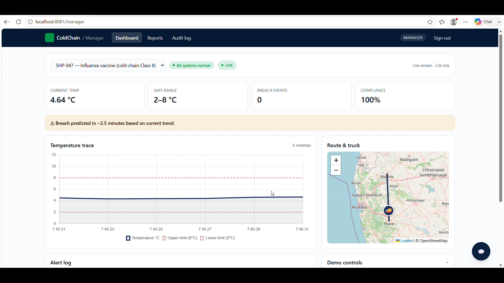
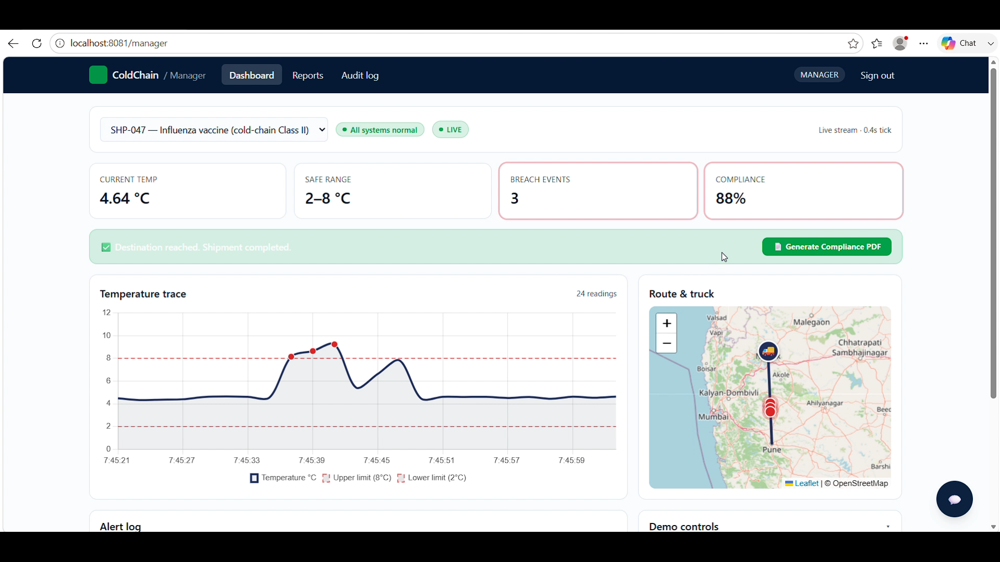
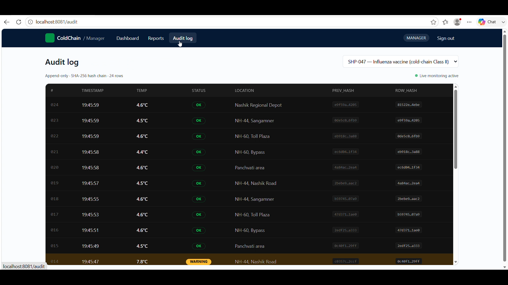
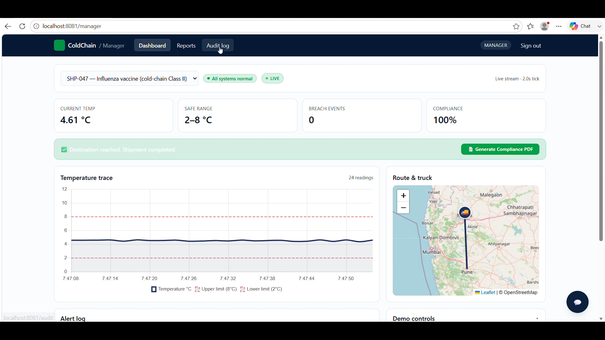
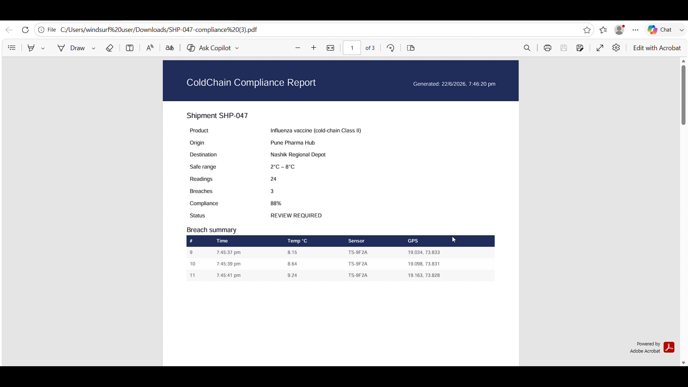
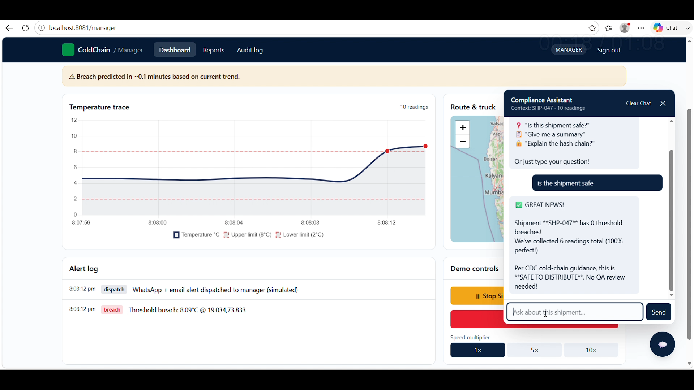
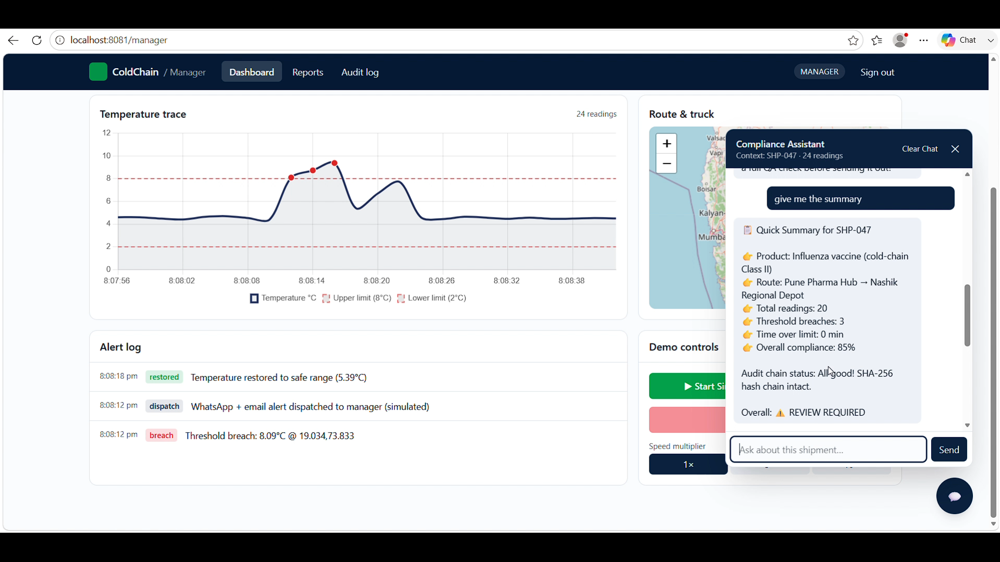
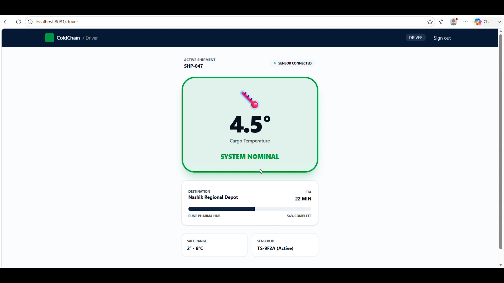

# Cold Chain Guard

> Predictive Cold Chain Compliance & Audit Platform for Pharmaceutical Logistics

---

## 📌 Problem & Domain

Temperature-sensitive products such as vaccines, insulin, biologics, and perishable food items require strict temperature control during transportation. Even a brief temperature excursion can compromise product quality, lead to financial losses, and violate regulatory standards.

Traditional monitoring systems often rely on manual records, fragmented monitoring tools, and delayed reporting, making it difficult to ensure compliance and prevent spoilage.


**Themes Selected (at least one):**
- [ ] Human Experience & Productivity  
- [ ] Climate & Sustainability Systems  
- [✅] HealthTech & Bio Platforms  
- [ ] Learning & Knowledge Systems  
- [ ] Work, Finance & Digital Economy  
- [ ] Infrastructure, Mobility & Smart Systems  
- [ ] Trust, Identity & Security  
- [ ] Media, Social & Interactive Platforms  
- [✅] Public Systems, Governance and Civic Tech  
- [ ] Developer Tools & Software Infrastructure  

---

## 🎯 Objective

Cold Chain Guard is designed for pharmaceutical companies, healthcare distributors, logistics providers, and regulatory auditors.

### Target Users

- Pharmaceutical Manufacturers
- Vaccine Distributors
- Healthcare Logistics Providers
- Cold Storage Operators
- Regulatory Auditors

### Pain Points

- Lack of real-time visibility during transportation
- Delayed detection of temperature breaches
- Manual compliance reporting
- Risk of record tampering
- Product spoilage leading to heavy financial losses

### Solution

Cold Chain Guard provides:

- Real-time shipment monitoring
- Predictive breach detection
- Immutable audit logs
- Automated compliance reporting
- AI-powered compliance assistant
- Blockchain-backed verification

---

## 🧠 Team & Approach

### Team Name:  `Soft Circuits`

### Team Members:  

- [Jatin Vishwakarma](https://github.com/coddingjatin)
- [Chaitanya Rathod](https://github.com/chaitanyaRathod14)
- [Richa Waghmare](https://github.com/richa-waghmare)
- [Samarth Mane](https://github.com/SamarthMane09)

### Why We Chose This Problem

Cold-chain failures can result in massive product losses and directly impact public health. Existing systems focus on monitoring, but very few provide predictive intelligence, automated compliance, and trustworthy audit evidence in one platform.

### Challenges Addressed

- Real-time temperature monitoring
- Early breach prediction
- Tamper-proof audit trails
- Compliance automation
- Easy access to compliance information using AI

---

## 🛠️ Tech Stack

### Frontend

- React.js
- TypeScript
- Tailwind CSS
- Chart.js
- WebSockets

### Backend

- Node.js
- Express.js

### Database

- Firebase
- InfluxDB (Time-Series Sensor Data)

### Additional Technologies Used (Optional):
- [✅] AI / ML  
- [ ] Web3 / Blockchain  
- [ ] Cyber Security 
- [ ] Cloud  

---

## ✨ Key Features

### Real-Time Temperature Monitoring

Monitor temperature readings from shipments through a live dashboard with real-time updates.

### Instant Breach Detection

Automatically detects temperature violations and generates alerts whenever thresholds are exceeded.

### Predictive Breach Detection

Analyzes temperature trends and predicts potential breaches before they occur, enabling proactive intervention.

### Immutable Audit Trail

Stores all shipment readings as append-only records to ensure transparency and compliance.

### Automated Compliance Reports

Generates audit-ready PDF reports containing:

- Shipment Details
- Temperature History
- Compliance Percentage
- Breach Summary
- Verification Hash

### AI Compliance Assistant

Ask questions in natural language:

> Was shipment SHP-047 compliant?

> How many breaches occurred during transit?

> Show all violations in the last 24 hours.

---
## 📸 Demo Images

<p align="center">
  
</p>

<p align="center">
  
</p>

<p align="center">
  
</p>

<p align="center">
  
</p>

<p align="center">
  
</p>

<p align="center">
  
</p>

<p align="center">
  
</p>

<p align="center">
  
</p>

## 📽️ Demo Video

- **Demo Video Link:** https://youtu.be/p-7zFQdUSTE   

## Architecture

```text
Sensor Simulator
       │
       ▼
 REST API Layer
       │
 ┌─────┼─────┐
 ▼     ▼     ▼
Breach AI   Alert
Detect Predictor Dispatcher
 │      │       │
 ▼      ▼       ▼
Storage Layer
       │
 ┌─────┼─────────────┐
 ▼     ▼             ▼
Dashboard PDF     AI Assistant
```
---

## ✅ Tasks & Bonus Checklist

- [✅] All team members completed the mandatory social task  
- [✅] Bonus Task 1 – Badge sharing  
- [✅] Bonus Task 2 – Blog/article  

---
## 🚀 Demo Workflow

1. Create a shipment.
2. Simulated sensors begin sending readings.
3. Dashboard displays live temperature data.
4. A temperature spike is injected.
5. Breach detector triggers alerts.
6. AI predictor forecasts upcoming violations.
7. Compliance report is generated automatically.
8. Users query shipment status through the AI assistant.

---

## 🧬 Future Scope

- Multi-sensor environmental monitoring
- Humidity and vibration tracking
- Route optimization recommendations
- Enterprise fleet integration
- Advanced anomaly detection
- Multi-language compliance reports
- Global regulatory compliance templates

---

## 📊 Impact

Cold Chain Guard transforms cold-chain monitoring from a reactive process into a proactive compliance platform.

### Benefits

- Reduce product spoilage
- Improve supply-chain visibility
- Automate compliance workflows
- Accelerate audits
- Strengthen trust and transparency
- Improve public health outcomes

---

## 🏁 Final Words

What started as a simple idea to monitor temperature-sensitive shipments evolved into a platform focused on **prediction, compliance, and trust**.

During HackHazards, we challenged ourselves to solve a real-world problem faced by pharmaceutical and healthcare supply chains worldwide. Instead of building another dashboard, we created a system capable of predicting temperature breaches, generating audit-ready compliance reports, maintaining tamper-evident logs, and providing AI-powered insights.

This journey pushed us to learn new technologies, collaborate effectively under time constraints, and transform an idea into a meaningful solution with real-world impact.

A heartfelt thank you to the organizers, mentors, judges, and the amazing hacker community for making this experience unforgettable.

**Cold Chain Guard is more than a monitoring tool, it's a step towards safer, smarter, and more accountable healthcare logistics.**
